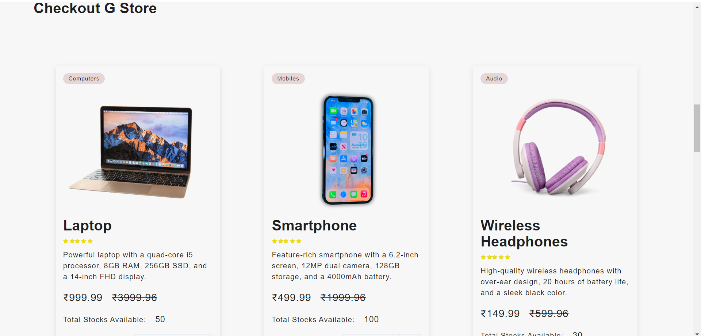
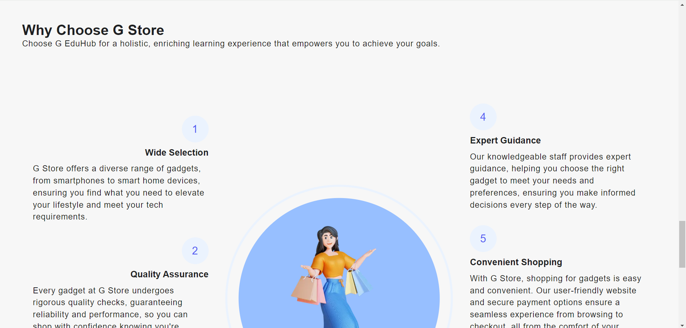
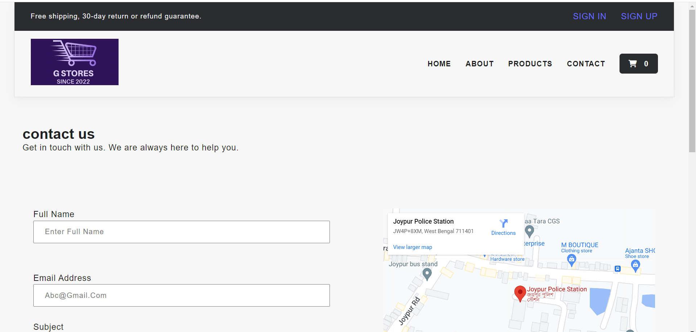
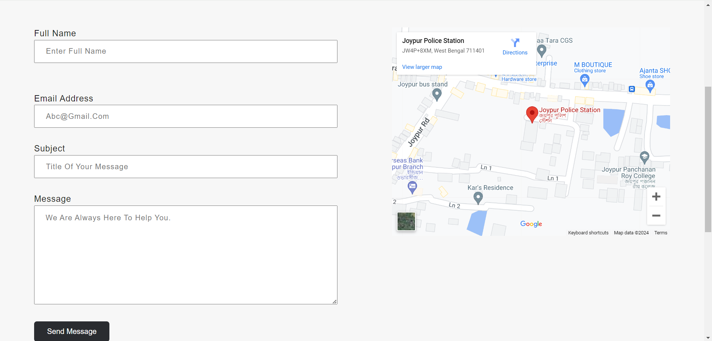
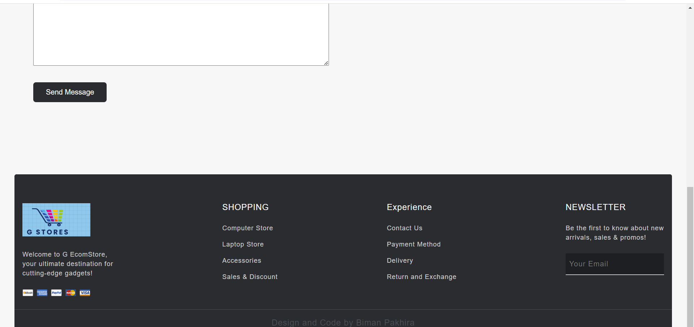

# eCommerce Website Project

Welcome to our eCommerce Website Project! This project aims to develop a cutting-edge ecommerce website that provides users with a seamless and intuitive online shopping experience.

## Technologies Used

- **Frontend**:
  - React
  - HTML/CSS
  - Vite.js

## Features

- User authentication (login, logout)
- Browse products by categories
- Search products by name or category
- Add products to cart
- View and manage cart
- Checkout process
- Responsive design for mobile and desktop browsers
  
## Sample View









## Getting Started

To get a local copy of this project up and running on your machine, follow these steps:

### Prerequisites

- Node.js (npm)

### Installation

1. **Clone the repository**

   ```bash
   git clone https://biman-pakhira.github.io/eCommerce-Website-Project/
   ```
2. **Change the Directory**

   ```bash
    cd your Directory
   ```
3. **Run this Project**

   ```bash
    npm run dev
   ```
